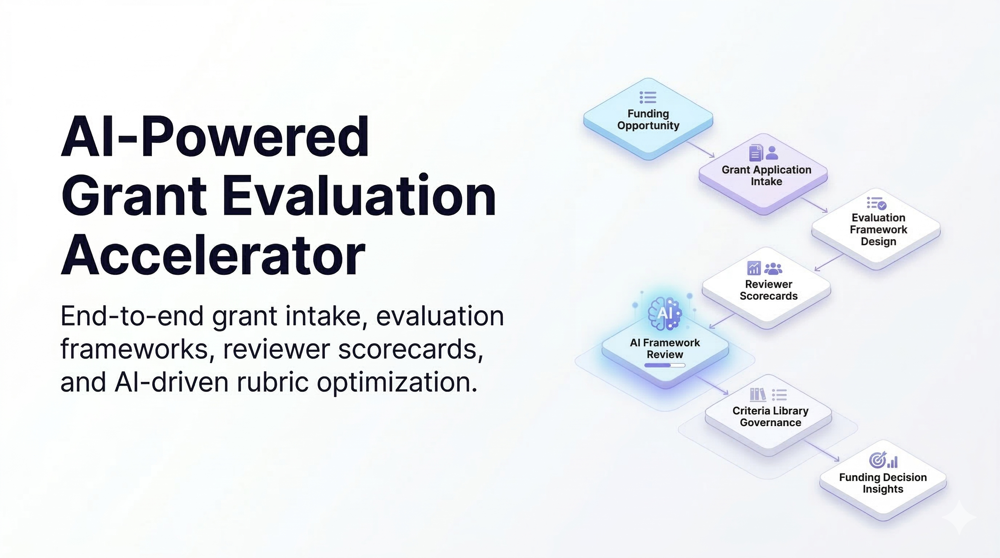

# GrantScoreCard – AI-Powered Grant Evaluation Accelerator


GrantScoreCard is a Salesforce DX starter project for a complete grant review lifecycle on Public Sector Solutions / Grants Management.  

It covers applicant intake, rubric setup, reviewer assignment, AI-assisted scoring, and application status tracking.

## Latest Update News (March 13, 2026)

- OmniStudio intake framework release is now stabilized in Experience Cloud:
  - OmniScript `GrantIntake_MVP_English_1`
  - Integration Procedure `GrantIntake_AnalyzeProject_English_1`
  - Data Mapper/DataRaptor `DRXFundingOpportunitySearch_1`
- AI response mapping is aligned to Prompt Builder output contract:
  - `summary -> aiSummary`
  - `recommendedFundingTypes -> recommendedFundingTypes`
  - `keywords -> keywords`
  - `confidenceScore -> confidenceScore`
- Intake UI cleanup completed:
  - temporary debug blocks removed from discovery step
  - wrapper callout refreshed with native `utility:einstein` icon rendering
  - results step restyled as `AI Funding Analysis` with confidence/category/topic panels
- Latest deployment to org alias `GRANTS`:
  - `0AfHp00003ni0wyKAA` (OmniScript + Integration Procedure) - Succeeded

## One-Click Deploy

<a href="https://githubsfdeploy.herokuapp.com?owner=RussEvans222&repo=GrantScoreCard&ref=main">
  
</a>

## Architecture Overview



This project demonstrates an end-to-end AI-enhanced grant evaluation pipeline on Salesforce:

Funding Opportunity  
-> Grant Application Intake  
-> Evaluation Framework Design  
-> Reviewer Scorecards  
-> AI Framework Review  
-> Criteria Library Governance  
-> Funding Decision Insights

## Data Model

Canonical grantmaking model (unchanged):

```text
FundingOpportunity
  -> Evaluation_Template__c
    -> Evaluation_Template_Criterion__c
```

Application evaluation flow:

```text
ApplicationForm
  -> ApplicationFormEvaluation
    -> Evaluation_Criterion_Score__c
```

## OmniStudio Platform Stack

```text
Experience Cloud
  -> OmniScripts
  -> FlexCards
  -> Integration Procedures
  -> Data Mappers
```

OmniStudio assets in this repo are source-tracked under `force-app/main/default/` via:
- `omniScripts`
- `omniIntegrationProcedures`
- `omniDataTransforms`
- `omniUiCard`

## Evaluation Architecture

- Evaluation templates and criteria remain the authoritative rubric source.
- Reviewer scoring continues through `ApplicationFormEvaluation` and `Evaluation_Criterion_Score__c`.
- Intake modernization does not alter evaluator assignment/scoring data contracts.

## AI Integration Layer

```text
Integration Procedures
  -> Prompt Builder
  -> Agentforce
```

AI guardrail:
- AI outputs are advisory and must never auto-populate `Evaluation_Criterion_Score__c`.

## 🤖 AI Capabilities

Icon placeholder/reference: `docs/images/icons/einstein-ai.png`

This accelerator demonstrates how Salesforce Einstein and Prompt Builder
can enhance grant evaluation workflows using AI-powered analysis,
automation, and intelligent recommendations.

###  Evaluation Framework Review

The system uses prompt template `EvaluationFrameworkReview`.

This AI analyzes evaluation frameworks and identifies:

- weight imbalances  
- redundant criteria  
- unclear scoring guidance  
- missing evaluation dimensions  

The result is structured JSON used to generate framework health scores and improvement recommendations.

###  AI Scorecard Suggestions

Reviewer scorecards can generate AI-assisted scoring guidance
based on evaluation criteria and application context.

This helps reviewers:

- score consistently  
- reduce bias  
- identify key evaluation factors

###  Evaluation Template Display Name Generator

The prompt template `ETDisplayName` generates concise, meaningful display names
for evaluation templates by analyzing:

- template description  
- selected evaluation criteria  
- scoring structure

Example outputs:

Innovation Impact Grant Review  
Community Development Evaluation  
Economic Growth Program Scoring

### AI Architecture

AI capabilities in this project are implemented using:

- Salesforce Prompt Builder  
- Einstein Trust Layer  
- Apex orchestration services  
- Lightning Web Components for UI integration  

Prompt outputs are parsed and optionally persisted back to Salesforce records
to enhance evaluation workflows.

## Latest Updates (March 11, 2026)

- Rubric setup wizard simplified to a cleaner admin flow:
  - optional clone -> criteria selection -> matrix configuration -> activation
  - library management removed from normal setup path
  - bundle-oriented language in criteria editing
- Application status card updated to use Lightning Data Service on `ApplicationForm` record context.
- Assign Reviewers experience improved:
  - clean confirmation messaging
  - task automation tuned for review workflow
  - reviewer notification email format updated
- Scorecard AI experience updated:
  - default mode is `Overwrite all`
  - button label is `Run AI Evaluation`
  - helper text clarifies reviewer final authority
- AI prompt guidance improved for evidence-based rationale quality and balanced 1-5 scoring.


## Developer Change Log (Synced)

Primary developer log is maintained in:
- `docs/developer-change-log.md`

Top highlights from the latest OmniStudio release pass:
- Removed temporary intake debug instrumentation from `GrantIntake_MVP_English_1` to restore clean UX.
- Fixed Experience wrapper callout to use native SLDS Einstein icon rendering.
- Refined AI results presentation into a structured `AI Funding Analysis` step.
- Published updated OmniScript/UI metadata to org `GRANTS`.

## Changelog

### March 12, 2026

- Released first OmniStudio intake framework milestone:
  - `GrantIntake_MVP_English_1` (OmniScript)
  - `GrantIntake_AnalyzeProject` (Integration Procedure)
  - `DRXFundingOpportunitySearch` (Data Mapper/DataRaptor)
  - Experience Cloud runtime discovery flow with AI analysis + funding recommendations
- Added roadmap + release documentation:
  - `docs/product-roadmap.md`
  - `docs/CHANGELOG.md`

- Added a new **🤖 AI Capabilities** section near the top of this README with Einstein callouts for:
  - Evaluation Framework Review (`EvaluationFrameworkReview`)
  - AI Scorecard Suggestions (`AFE_Criterion_Scoring_Suggestion`, `AFE_Scorecard`)
  - Evaluation Template Display Name Generator (`ETDisplayName`)
- Added an **AI Architecture** summary covering Prompt Builder, Einstein Trust Layer, Apex orchestration, and LWC integration.
- Added Einstein icon asset reference path for AI capability visuals:
  - `docs/images/icons/einstein-ai.png`
- Expanded developer log references and prompt documentation alignment for template display-name generation.
- Updated template label handling to support cleaner display names in admin experiences when `Display_Name__c` is populated.

### March 11, 2026

- Refactored README feature documentation into a clearer, user-friendly walkthrough for all core grantmaking capabilities.
- Updated banner documentation to match current repo assets:
  - Verified existing files for Intake, AI Scorecard, and Status Tracker.
  - Kept explicit placeholder paths for Rubric Setup, Criterion Library, and Reviewer Assignment.
- Added banner preview slots so new header images can be dropped in without further README edits.
- Consolidated feature language around applicant intake, rubric setup, criterion library reuse, reviewer assignment automation, AI-assisted scoring, and status visibility.
- Fixed scorecard data refresh behavior after save:
  - Removed cacheable reads from `AFEScorecardController` score/summary/context methods to avoid stale LWC data.
  - Added LDS `notifyRecordUpdateAvailable` calls from `afeScorecard` after save operations so related record-page cards refresh immediately.
- Updated reviewer assignment defaults:
  - New `ApplicationFormEvaluation` records now initialize with `Status = In Progress` (with picklist-safe fallback).
- Added AI confidence auto-population:
  - `ApplicationFormEvaluation.AI_Confidence__c` now calculates from weighted agreement between AI suggested scores and reviewer final scores once all rubric rows are scored.
- Deployed these metadata updates to org alias `GRANTS` (Deploy ID: `0AfHp00003nhtVMKAY`, Status: Succeeded).
- Resolved score-save runtime errors by validating live org metadata for `ApplicationFormEvaluation.AI_Confidence__c`:
  - Confirmed field type is `Picklist` with values `High`, `Medium`, `Low`.
  - Updated scorecard save logic to map computed confidence to org-supported picklist values instead of writing raw decimals.
  - Added type-safe assignment handling for schema variants.
- Enhanced `afeScorecard` context screen UX:
  - Added a new **Scored Criteria and Rationale** panel that surfaces completed criterion scores and rationale text without switching screens.
  - Added visual score chips, structured criterion cards, and responsive layout improvements for readability.
- Additional deployments completed to org alias `GRANTS`:
  - `0AfHp00003nhtWjKAI` (AFEScorecardController confidence type-safety update) - Succeeded
  - `0AfHp00003nhtWyKAI` (AFEScorecardController picklist mapping update) - Succeeded
  - `0AfHp00003nhtUtKAI` (`afeScorecard` UI enhancement bundle) - Succeeded

## Feature Walkthrough

### 1) Applicant Intake

Launch path: `FundingOpportunity.Apply Now` -> `Grant_Application_Intake_Flow`

- Applicants complete a guided submission flow instead of filling out raw object fields.
- The flow creates a new `ApplicationForm` and links it to the funding opportunity.
- After submit, teams can immediately track progress on the new application record.


### 2) Evaluation Rubric Setup (Admin)
Launch path: `FundingOpportunity.Setup Evaluation Criteria` -> `Evaluation_Template_Wizard_Flow`

- Program admins build the scoring rubric reviewers will use.
- Admins can start from scratch or clone from an existing funding opportunity.
- The wizard publishes a versioned template that drives downstream scoring.

### 3) Criterion Library (Admin Data)


- Central library for reusable criteria and rubric bundles.
- Keeps language and scoring standards consistent across funding programs.
- Reduces rework when standing up new opportunities.

### 4) Reviewer Assignment
 
Launch path: `ApplicationForm.Assign Reviewers` -> `Assign_Reviewers_Create_Evaluations`

- Assigns one or more reviewers to an application in a single action.
- Creates `ApplicationFormEvaluation` records automatically.
- Triggers assignment side effects such as status updates, tasks, and notifications.

### 5) AI Evaluation Scorecard
 
Banner: `docs/images/headers/scorecard-ai/05-scorecard-ai-header-1600x200.png`  
Core: `afeScorecard` LWC + `AFEScorecardController`

- Reviewers score each criterion with weighted rubric controls.
- AI can propose draft scores and rationales to speed up evaluation.
- Reviewers remain in control of final scoring decisions.

### 6) Application Status Tracker
   
Core: `applicationStatusTracker`

- Displays current application progress directly on the application record.
- Pulls status from record context so users see live state after submission.
- Provides a simple, reassuring status view for applicants and staff.

### 7) Evaluation Criteria Manager (Admin Workspace)
- Purpose-built workspace to manage reusable criteria, bundle assignments, and template usage from one app.
- Includes Criteria Insights actions to analyze framework quality and open related template records.
- Supports inline editing of user-facing template display names (when configured fields and FLS allow updates).

### 8) OmniStudio Grant Discovery Intake (Experience Cloud)
- Entry point: Experience Cloud route `grantDiscovery`.
- Runtime component: `runtime_omnistudio:omniscript` configured for `Type=GrantIntake`, `Subtype=MVP`, `Language=English`, `Version=1`.
- Analyze flow:
  - `Step_ProjectDiscovery` collects project description.
  - IP `GrantIntake_AnalyzeProject` calls Apex gateway.
  - Apex invokes Prompt Builder template `Grant_Project_Funding_Analysis`.
  - Response populates `context.*` analysis fields and funding opportunities.
- Results flow:
  - `Step_FundingFinder` renders recommended opportunities from `context.fundingOpportunities`.
  - Relevance and analysis output are prepared for user selection and downstream intake continuation.

### 9) Full-Page Intake Wrapper (New)
- New LWC: `grantIntakeFullPage` provides a full-screen host shell for Experience layouts.
- Styling includes:
  - soft blue/purple gradient page background
  - centered max-width intake surface
  - responsive behavior for desktop/mobile.
- Configurable property:
  - `omniScriptPageUrl` (default: `/grantmaking1/s/grantDiscovery`).

## Prerequisites

- Salesforce CLI (`sf`)
- Access to a target org (alias examples use `GRANTS`)
- Einstein Prompt Builder enabled for AI features
- User permissions to deploy metadata and assign permission sets

## Deployment Instructions

Use the curated manifest and setup runbook for repeatable deployment:
- `config/deploy-manifest-accelerator-curated.xml`
- `docs/setup/accelerator-deployment-readiness.md`

## Quick Start

Deployment-ready path for fresh PSS orgs:
- Curated manifest: `config/deploy-manifest-accelerator-curated.xml`
- Staged runbook: `docs/setup/accelerator-deployment-readiness.md`

### 1) Clone + auth

```bash
git clone https://github.com/RussEvans222/GrantScoreCard.git
cd GrantScoreCard
sf org login web --alias GRANTS
```

### 2) Deploy core metadata

```bash
sf project deploy start \
  --target-org GRANTS \
  --manifest config/deploy-manifest-accelerator-curated.xml \
  --wait 60
```

### 3) Seed section + criterion library data

```bash
sf apex run --target-org GRANTS --file scripts/apex/seed_grantmaking_demo.apex
```

### 4) Assign permission sets

```bash
sf org assign permset --target-org GRANTS --name Evaluation_Rubric_Admin
sf org assign permset --target-org GRANTS --name ApplicationForm_Applicant_Access
```

## Prompt Templates

Required templates used by scorecard Apex:

- `AFE_Criterion_Scoring_Suggestion` (single criterion AI)
- `AFE_Scorecard` (bulk AI)
- `EvaluationFrameworkReview` (framework quality analysis)
- `ETDisplayName` (evaluation template display-name generation)

Bulk expected response contract:

```json
{
  "scores": [
    {
      "criterionId": "a96...",
      "score": 3,
      "reason": "Short criterion-specific rationale"
    }
  ]
}
```

## Post-Deploy Checklist

1. Activate flows:
   - `Grant_Application_Intake_Flow`
   - `Evaluation_Template_Wizard_Flow`
   - `Assign_Reviewers_Create_Evaluations`
   - `Initialize_Evaluation_Criteria_Scores`
   - `Recalculate_AFE_Weighted_Total`
2. Confirm quick actions:
   - `FundingOpportunity.Apply Now`
   - `FundingOpportunity.Setup Evaluation Criteria`
   - `ApplicationForm.Assign Reviewers`
3. Confirm page placements:
   - `afeScorecard` on `ApplicationFormEvaluation`
   - `applicationStatusTracker` on `ApplicationForm`

## Smoke Validation

1. Configure a rubric on a Funding Opportunity and publish it.
2. Submit intake via `Apply Now`.
3. Verify redirect to created `ApplicationForm`.
4. Run `Assign Reviewers` and confirm:
   - AFEs are created
   - Stage updates to `In Review`
   - tasks and reviewer emails are generated
5. Open an AFE scorecard and run AI evaluation (single + bulk).

## Troubleshooting

### AI bulk fallback behavior

Check logs for:

- `AI PROMPT INVOKE template=AFE_Scorecard`
- `AI RAW RESPONSE TEXT:`

Common causes:

- prompt template missing/inactive
- prompt input resource mismatch
- model/runtime access not enabled for running user

### Reviewer flow template missing message

Ensure `FundingOpportunity.Evaluation_Template__c` points to an active published template.

## Developer Change Logs


This section tracks major development changes so new developers can understand how the system has evolved and where to start learning.

- AI evaluation framework services
- prompt invocation architecture
- JSON response parsing
- criteria library governance
- Lightning Web Component workspace development
- evaluation template management
- developer debugging improvements

Detailed daily entries: [`docs/developer-change-log.md`](docs/developer-change-log.md)

## Repo Structure

- `config/deploy-manifest-core.xml` - deploy manifest
- `config/deploy-manifest-accelerator-curated.xml` - curated accelerator deployment manifest
- `scripts/apex/seed_grantmaking_demo.apex` - idempotent seed data
- `docs/setup/demo-org-setup.md` - setup runbook
- `docs/setup/accelerator-deployment-readiness.md` - staged deployment + readiness matrices
- `docs/testing/e2e-test-plan.md` - test scenarios
- `docs/architecture/component-map.md` - component dependency map

## Extension Notes

- Preserve `Evaluation_Template__c` version semantics (draft/published)
- Keep reviewer side effects in `AssignReviewersCreateEvaluationsAction`
- Preserve scorecard AI parser contract keys (`criterionId`, `score`, `reason`)
